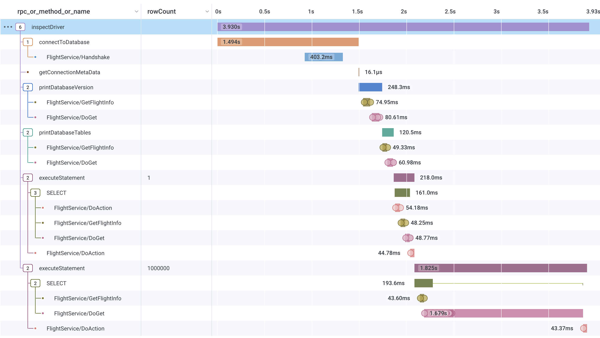

# Tracing Apache Arrow Flight SQL JDBC

This repo contains an example program for tracing what happens behind the scenes when 
utilizing the [Apache Arrow Flight SQL JDBC driver](https://arrow.apache.org/docs/java/flight_sql_jdbc_driver.html)
to interact with an Apache [Arrow Flight SQL](https://arrow.apache.org/docs/java/flight_sql.html) capable database.

The example program utilizes [OpenTelemetry](https://opentelemetry.io/) to auto-instrument the JDBC and gRPC
interactions of the application.



## [Re]building the Arrow Flight SQL JDBC Driver

The version of the Arrow Flight SQL JDBC driver that is
[published in Maven Central](https://search.maven.org/artifact/org.apache.arrow/flight-sql-jdbc-driver/14.0.2/jar)
is a [shaded and relocated](https://maven.apache.org/plugins/maven-shade-plugin/examples/class-relocation.html) 
JAR. Subsequently, OpenTelemetry's auto-instrumentation does not work properly for the gRPC calls made by the JDBC 
driver. This issue has been raised in [apache/arrow#37892](https://github.com/apache/arrow/issues/37892). However, 
thus far this deficiency has not been addressed.

As a result, if you want to include the gRPC calls (and anything else that's broken by shading + relocating) in 
the OpenTelemetry traces, you will need a custom version of the driver. The [build_arrow.sh](build_arrow.sh) 
script will do this by cloing the apache/arrow repository, switching to the 14.0.2 tag, applying the 
[fix_jdbc_shading.patch](fix_jdbc_shading.patch) patch file, and then building and installing the corresponding JAR 
files in a custom local Maven repository, which is referenced from [pom.xml](pom.xml).

In order for that script to work, you will need: git, Maven, and a Java compiler. If you don't want to deal with
installing those dependencies, you can use the Maven Docker container image. From the project directory, execute 
the following shell command:

```shell
docker run -it --rm -v $(pwd):/tmp/project maven:latest /tmp/project/build_arrow.sh
```

When the above completes, you should see the JDBC driver in the `.m2_local` directory:

```
$ tree .m2_local| grep flight-sql-jdbc-driver
│   │   │   └── flight-sql-jdbc-driver
│   │   │       │   ├── flight-sql-jdbc-driver-14.0.2-cyclonedx.json
│   │   │       │   ├── flight-sql-jdbc-driver-14.0.2-cyclonedx.xml
│   │   │       │   ├── flight-sql-jdbc-driver-14.0.2-shaded.jar
│   │   │       │   ├── flight-sql-jdbc-driver-14.0.2-tests.jar
│   │   │       │   ├── flight-sql-jdbc-driver-14.0.2.jar
│   │   │       │   └── flight-sql-jdbc-driver-14.0.2.pom
```

## Configuring OpenTelemetry

The program utilizes [OpenTelemetry Automatic Instrumentation](https://opentelemetry.io/docs/instrumentation/java/automatic/) 
and supports a [wide range of configuration options](https://opentelemetry.io/docs/instrumentation/java/automatic/agent-config/).

If you happen to be using [Honeycomb](https://www.honeycomb.io/), you only need to set three environment variables
in order for your traces to be sent there:

```
OTEL_EXPORTER_OTLP_ENDPOINT=https://api.honeycomb.io
OTEL_EXPORTER_OTLP_HEADERS=x-honeycomb-team=${YOUR HONEYCOMB API KEY GOES HERE}
OTEL_SERVICE_NAME=${WHATEVER SERVICE NAME/DATASET YOUR TRACES SHOULD APPEAR UNDER}
```
